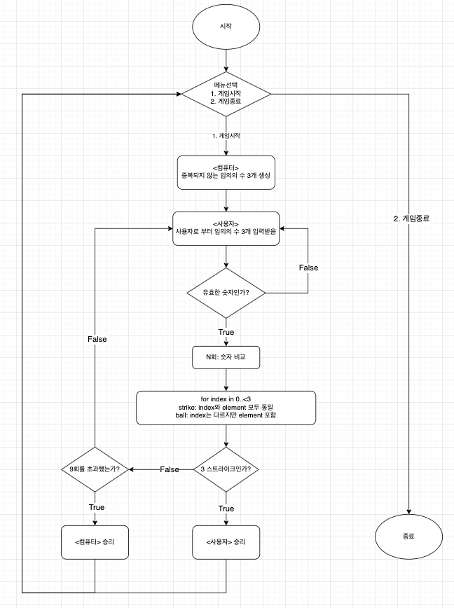
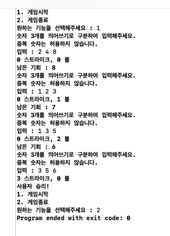
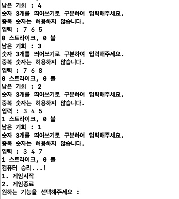
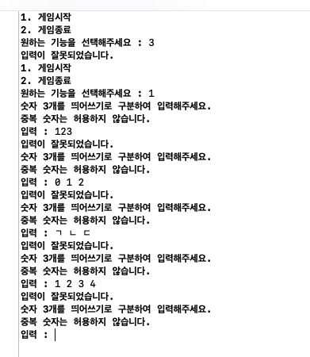

## iOS 커리어 스타터 캠프

### 1. 제목
- 숫자 야구

### 2. 소개
- 사용자로부터 3개의 숫자를 입력받아서 컴퓨터가 정한 3개의 숫자를 비교하며 숫자 야구를 진행하는 프로그램입니다.
컴퓨터와 같은 위치에 같은 숫자가 있다면 Strike, 위치가 다르지만 컴퓨터가 가지고 있는 숫자를 사용자가 가지고 있다면 볼로 판단하며,
9회 내에 3 Strike를 기록해야 사용자가 승리할 수 있습니다.

### 3. 팀원
- Zion, Minsup

### 4. 시각화된 프로젝트 구조 (FlowChart)

### 5. 실행 화면(기능 설명)

- 사용자가 9회내에 3strike를 기록해 승리하는 화면

- 사용자가 9회내에 3strike를 기록하지 못해 컴퓨터가 승리하는 화면

- 사용자의 입력이 유효하지 않은 경우에 대한 예외처리 입니다.

### 6. 트러블슈팅
- 하나의 함수가 하나의 기능 및 책임만을 담당할 수 있도록 설계하고 구현하는 일이 어려웠습니다. 문제를 명확하게 이해했다고 생각하고 구현을 시작했지만 구현을 함면서 점점 함수의 기능이 추가되고, 다시 다른 함수로 기능을 분리시키고 책임 및 목적을 분리해서 처리할 수 있도록 설계하는 부분이 어려웠습니다.

- 사용자의 입력을 받은 후 사용자의 입력에 대한 유효성 검사를 수행하는 부분에 있어서 예외처리에 대한 방식을 정하는데 있어서 많은 고민을 했습니다.
Do catch문을 사용해서 Error에 따른 종류를 만들어서 처리할지, ResultType을 만들어서 Success가 되었을 때 numberList를 넘겨받을지에 대해 많은 논의를 했습니다. 논의 결과 현재 과제에서 명세한 예외는 위와 같은 종류가 아닌 guard let으로 충분히 처리할 수 있고 명확히 표시가 될 수 있다는 판단을 했고 위와 같이 구현하게되었습니다.

- 네이밍을 정하는 과정에서 협업을 통해 내가 아닌 다른 사람과 같이 네이밍을 정하다보니 합을 맞추는 과정에서 조금 시간이 들었습니다.
서로 다른 생각을 했다뿐이지 틀린 의견은 없었기 때문에 조금 더 분명하고 명확한 네이밍을 선정하는 과정이 이번 과제에서 가장 많은 노력을 들였습니다.

- FlowChart로 표현해야 하는 범위에 대해 생각해봤습니다. Step1, Step2의 프로그램의 전체적인 흐름을 표현해야하는 FlowChart의 특성상 과제에서 제시하고 있는 예외처리 전부를 FlowChart에 넣게되면 오히려 프로그램의 전체적인 흐름을 파악하는 FlowChart의 목적성을 해칠 수 있다고 판단했습니다. 따라서 Flow에 영향을 줄 수 있는 핵심적인 프로그램의 동작 및 분기를 기준으로 FlowChart를 작성했습니다.

### 7. 참고자료
- https://velog.io/@un1945/Swift-Result-Type
- https://velog.io/@folw159/Swift-components%EC%99%80-split%EC%9D%98-%EC%B0%A8%EC%9D%B4
